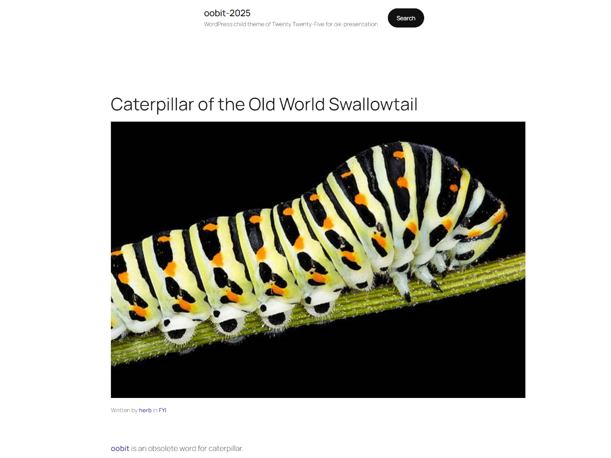

# oobit-2025 

* Contributors: bobbingwide
* Requires at least: 6.6
* Tested up to: 6.6
* Requires PHP: 5.7
* License: GPLv2 or later
* License URI: http://www.gnu.org/licenses/gpl-2.0.html

## Description 

WordPress child theme of Twenty Twenty-Five for oik-presentation

## Changelog 

# 0.1.0 
Second version for testing on PHPHants

* Update style.css to v0.1.0. Add Tags: #1
* Reduce font size of widgets in the footer #3
* Use large rounded site logo instead of an uploaded image. Change header site logo to rounded #10
* Improve post meta information #9
* Rely on oik invoking oik_add_shortcodes for block based themes #2
* Improve home template. Add featured image, post edit block, separator, etc #1
* Update the screenshot #1

# 0.0.1 
First version uploaded to bobbingwide.com for testing on PHPHants

* Adjust custom styles for links #7
* Add Single item: Presentation page #6
* Add author box to single page #5
* Make author box wide #4
* Add author-box template part #4
* Update footer template part #3
* After Save Changes to Theme #1
* Add network-sites-theme.html to implement [bw_blogs] shortcode #2
* Enable oik shortcode expansion #2
* Update after changing metadata #1
* Update after changing metadata #1
* oobit-2025 created as a child theme of Twenty Twenty-Five #1
* Initial commit

## Copyright 

oobit-2025 WordPress Theme, (C) 2024 bobbingwide
oobit-2025 is distributed under the terms of the GNU GPL.

* This program is free software: you can redistribute it and/or modify
it under the terms of the GNU General Public License as published by
the Free Software Foundation, either version 2 of the License, or
(at your option) any later version.

This program is distributed in the hope that it will be useful,
but WITHOUT ANY WARRANTY; without even the implied warranty of
MERCHANTABILITY or FITNESS FOR A PARTICULAR PURPOSE. See the
GNU General Public License for more details.

oobit-2025 is a child theme of Twenty Twenty-Five (https://wordpress.org/themes/twentytwentyfive/), (C) the WordPress team, [GPLv2 or later](http://www.gnu.org/licenses/gpl-2.0.html)

## Recommended Plugins 

oik

